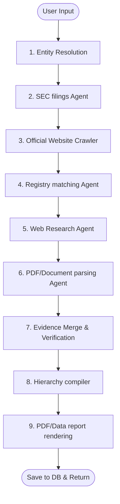

# Corporate Subsidiary Intelligence Platform

An enterprise-ready, multi-agent corporate intelligence auditing platform. Input any company name, ticker, domain, or branch, and the system automatically researches, resolves, normalizes, verifies, and maps its corporate subsidiary structures, rendering an interactive hierarchy tree and generating compliant PDF audit packages.

[](https://tarun1790.github.io/company-subsidiaries/)
[](https://render.com/)
[](https://railway.app/new)

---

## Key Features

- **9-Agent LangGraph Pipeline**: Orchestered multi-agent execution pipeline spanning Entity Resolution, SEC Edgar 10-K Exhibit 21 crawlers, Official Corporate Page Scrapers, Public Registries, Web Searches, and PDF Document Table extractors.
- **Traceable Evidence Matrix**: Every single subsidiary is verified against multiple sources with high-confidence scoring and direct text excerpts mapping back to source URLs.
- **Entity Normalization**: Custom deduplication algorithms standardizing spelling, strip corporate suffixes (`Ltd`, `LLC`, `GmbH`, `Inc.`), and merge duplicates.
- **Interactive Hierarchy Visualizer**: Beautiful minimalist tree visualizer with node collapse/expand support and detail explorer drawers.
- **Report Vault Exports**: Generates premium-styled PDFs (ReportLab), Excel Spreadsheets (openpyxl), CSV, and JSON packages.

---

## AI Multi-Agent Architecture



---

## Live Sharing Option: GitHub Codespaces

You can share a fully running instance of this project directly on GitHub! Anyone with access can spin up a complete, running cloud-hosted sandbox environment in one click:

1. Go to your GitHub repository: `https://github.com/tarun1790/company-subsidiaries`.
2. Click the green **Code** button.
3. Switch to the **Codespaces** tab and click **Create codespace on main**.
4. GitHub will build the dev container and install the Node & Python packages.
5. Once ready, launch two terminal windows in Codespaces to start the app:
   - **Backend**: `export PYTHONPATH=backend && uvicorn app.main:app --port 8000`
   - **Frontend**: `cd frontend && npm run dev`
6. Click **Open in Browser** on the port `5173` notification popup!

---

## Local Run (Dockerless Fallback)

If Docker is not configured, you can run the system using SQLite and in-memory caching fallbacks:

### 1. Setup Environment
Create `.env` file in the root folder:
```env
GEMINI_API_KEY=your_google_gemini_api_key
```

### 2. Run Backend
In a new terminal window:
```bash
python -m venv venv
source venv/bin/activate  # Or .\venv\Scripts\Activate.ps1 on Windows
pip install -r backend/requirements.txt
playwright install chromium
export PYTHONPATH=backend
uvicorn app.main:app --host 0.0.0.0 --port 8000 --reload
```

### 3. Run Frontend
In a separate terminal window:
```bash
cd frontend
npm install
npm run dev
```
Open **[http://localhost:5173](http://localhost:5173)** in your browser.
